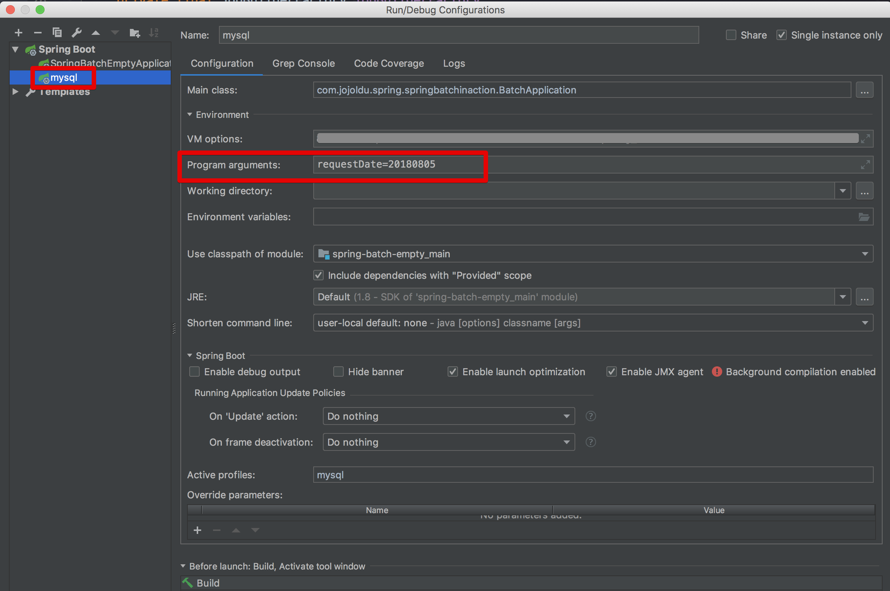
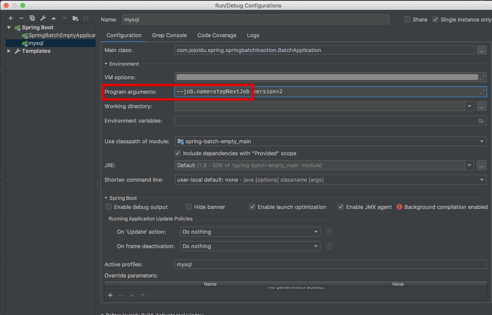

# Spring-Batch-Starter

## 2. Batch Job 실행해보기


### build.gradle
```bash
dependencies {
    compile('org.springframework.boot:spring-boot-starter-batch')
    testCompile('org.springframework.batch:spring-batch-test')
}
```

### Simple Job 생성

```java
// Application의 배치기능 활성화   
@EnableBatchProcessing
```

job/SimpleJobConfiguration 
```java
@Slf4j // log 사용을 위한 lombok 어노테이션
@RequiredArgsConstructor // 생성자 DI를 위한 lombok 어노테이션
@Configuration  //Spring Batch의 모든 Job은 @Configuration으로 등록해서 사용!
public class SimpleJobConfiguration {
    private final JobBuilderFactory jobBuilderFactory; // 생성자 DI 받음
    private final StepBuilderFactory stepBuilderFactory; // 생성자 DI 받음

    @Bean
    public Job simpleJob() {    //Batch Job
        return jobBuilderFactory.get("simpleJob")
                .start(simpleStep1())
                .build();
    }

    @Bean
    public Step simpleStep1() {
        return stepBuilderFactory.get("simpleStep1")
                .tasklet((contribution, chunkContext) -> {  //Step안에서 수행될 기능들을 명시. 단일로 수행될 커스텀한 기능
                    log.info(">>>>> This is Step1");
                    return RepeatStatus.FINISHED;
                })
                .build();
    }
}
```


Tasklet과 Reader & Processor & Writer 한 묶음은 같은 레벨

### MySQL 환경 셋팅

Spring Batch를 사용하기 위해 메타 데이터 테이블들이 필요

* 이전에 실행한 Job이 어떤 것들이 있는가?
* 최근 실패한 Batch Parameter가 어떤 것들이 잇고, 성공한 Job은 어떤 것들이 있는지
* 다시 실행한다면 어디서 부터?
* 어떤 Job에 어떤 Step들이 있고, Step들 중 성공한 Step, 실패한 Step은 어떤것인가


### 메타 테이블 구조

(출처 : <a href="https://docs.spring.io/spring-batch/3.0.x/reference/html/metaDataSchema.html">metaDataSchema</a>)

기본적으로 H2를 사용하면 자동으로 생성되지만, MySQL과 같은 DB를 사용할 때 직접 생성해야함!

### 스키마 생성

1. schema-mysql.sql 검색

2. 파일 안의 내용을 복사하여 실행

## 3. 메타 테이블

### 3-1. BATCH_JOB_INSTANCE

Job Parameter에 따라 생성되는 테이블(Spring Batch 실행 시 외부에서 받는 파라미터)

```java
@Slf4j // log 사용을 위한 lombok 어노테이션
@RequiredArgsConstructor // 생성자 DI를 위한 lombok 어노테이션
@Configuration
public class SimpleJobConfiguration {
    private final JobBuilderFactory jobBuilderFactory;
    private final StepBuilderFactory stepBuilderFactory;

    @Bean
    public Job simpleJob() {
        return jobBuilderFactory.get("simpleJob")
                .start(simpleStep1(null))
                .build();
    }

    @Bean
    @JobScope   //@JobScope 꼭 추가 할 것
    public Step simpleStep1(@Value("#{jobParameters[requestDate]}") String requestDate) {
        return stepBuilderFactory.get("simpleStep1")
                .tasklet((contribution, chunkContext) -> {
                    log.info(">>>>> This is Step1");
                    log.info(">>>>> requestDate = {}", requestDate);
                    return RepeatStatus.FINISHED;
                })
                .build();
    }
}
```
Program arguments에 파라미터 전달 


중복된 Job Parameter는 새로 생성되지 않는다!
```bash
A job instance already exists and is complete for parameters={requestDate=20180805}.  If you want to run this job again, change the parameters.
```

### 3-2. BATCH_JOB_EXECUTION

JOB_EXECUTION은 JOB_INSTANCE의 자식이다. JOB_INSTANCE에 대한 성공/샐패했던 모든 내역을 갖는다!

### 3-3. BATCH_JOB_EXECUTION_PARAMS

BATCH_JOB_EXECUTION_PARAM 테이블은 BATCH_JOB_EXECUTION 테이블이 생성될 당시에 입력 받은 Job Parameter를 담고 있다.


## 4. Spring Batch Job Flow

### 4-1. Next

Step들을 연결시킬 때 사용함. 

### 지정된 Batch Job만 실행되도록

application.yml

```markdown
#job.name이 있으면 왼쪽, 없으면 NONE
spring.batch.job.names: ${job.name:NONE} 
```

이후에 Program arguments에 다음과 같이 입력

```markdown
--job.name=stepNextJob
```



version은 계속해서 바꿔주어야 함.

### 4-2. 조건별 흐름 제어 (Flow)

Next의 문제는 특정 Step에서 오류 발생 시 다음 Step이 실행되지 않음.
Flow는 조건에 맞게 Step을 수행하도록 도와줌!

```java
    // Step의 종료 값을 명시적으로 지정
    contribution.setExitStatus(ExitStatus.FAILED);
``` 

### BatchStatus vs ExitStatus

참고 : <a href="https://jojoldu.tistory.com/328?category=635883">https://jojoldu.tistory.com/328?category=635883</a>

읽어보기....

### 4-3. Decide

분기를 담당!

```java
        @Bean
        public JobExecutionDecider decider() {
            return new OddDecider();
        }
    
        public static class OddDecider implements JobExecutionDecider {
    
            @Override
            public FlowExecutionStatus decide(JobExecution jobExecution, StepExecution stepExecution) {
                Random rand = new Random();
    
                int randomNumber = rand.nextInt(50) + 1;
                log.info("랜덤숫자: {}", randomNumber);
    
                if(randomNumber % 2 == 0) {
                    return new FlowExecutionStatus("EVEN");
                } else {
                    return new FlowExecutionStatus("ODD");
                }
            }
        }
```

## 5. Scope & Job Parameter

Spring Batche의 경우, 내/외부에서 파라미터를 받아 여러 Batch 컴포넌트에서 사용할 수 있다. 
이 파라미터를 Job Parameter라고 한다.
Job Parameter를 사용하기 위해서는 Scope를 선언해야 하는데, @JobScope와 @StepScope가 존재한다.
파라미터는 @Value와 SpEL을 이용해서 받는다.

```java
// Step 선언문에서 사용
@Bean
@JobScope
@Value("#{jobParameter[parameter]}")
```

```java
// tasklet, itemwriter, itemreader, itemprocessor에서 사
@Bean
@StepScope
@Value("#{jobParameter[parameter]}")
```

Job Parameter로는 Double, Long, Date, String 등의 타입을 사용할 수 있다.
Job Scope는 Job 실행시점에 Bean으로 등록된다. Job Parameter의 Late Binding이 된다.

## 7. ItemReader

ItemReader는 데이터를 읽어들이는 역할.
File, XML, JSON 등 다른 데이터 소스를 입력으로 사용할 수 있다.

### Cursor VS Paging

* Cursor 방식은 Database와 커넥션을 맺은 후, Cursor를 한칸씩 옮기며 지속적으로 데이터를 가져오는 방식
* Paging 방식은 한번에 정해진 PageSize만큼의 데이터를 가져오는 방식 


### PagingItemReader 주의사항

정렬이 무조건 필요하다. 

## 8. ItemWriter

ItemWriter는 출력 기능이다. Chunk 단위로 묶인 item list에 대한 처리를 수행한다.

### JpaItemWriter

JdbcItemWriter에 대한 내용은 생략..

```java
@Slf4j
@RequiredArgsConstructor
@Configuration
public class JpaItemWriterJobConfiguration {
    private final JobBuilderFactory jobBuilderFactory;
    private final StepBuilderFactory stepBuilderFactory;
    private final EntityManagerFactory entityManagerFactory;

    private static final int chunkSize = 10;

    @Bean
    public Job jpaItemWriterJob() {
        return jobBuilderFactory.get("jpaItemWriterJob")
                .start(jpaItemWriterStep())
                .build();
    }

    @Bean
    public Step jpaItemWriterStep() {
        return stepBuilderFactory.get("jpaItemWriterStep")
                .<Pay, Pay2>chunk(chunkSize)
                .reader(jpaItemWriterReader())
                .processor(jpaItemProcessor())
                .writer(jpaItemWriter())
                .build();
    }

    @Bean
    public JpaPagingItemReader<Pay> jpaItemWriterReader() {
        return new JpaPagingItemReaderBuilder<Pay>()
                .name("jpaItemWriterReader")
                .entityManagerFactory(entityManagerFactory)
                .pageSize(chunkSize)
                .queryString("SELECT p FROM Pay p")
                .build();
    }

    @Bean
    public ItemProcessor<Pay, Pay2> jpaItemProcessor() {
        return pay -> new Pay2(pay.getAmount(), pay.getTxName(), pay.getTxDateTime());
    }

    @Bean
    public JpaItemWriter<Pay2> jpaItemWriter() {
        JpaItemWriter<Pay2> jpaItemWriter = new JpaItemWriter<>();
        jpaItemWriter.setEntityManagerFactory(entityManagerFactory);
        return jpaItemWriter;
    }
}
```
spring-boot-starter-jpa를 의존성으로 등록하면 Entity Manager가 bean으로 자동 생성되어 DI만 해주면 된다.

### Custom ItemWriter

```java
   @Bean
   public ItemWriter<Pay2> customItemWriter() {
       return items -> {
           for (Pay2 item : items) {
               System.out.println(item);
           }
       };
   }
```

@Override write()에 대한 부분만 구현해주면 된다.

### 참조
https://jojoldu.tistory.com